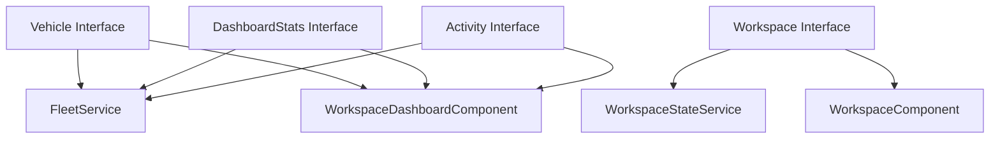

# Models Overview

This directory contains all the data structure interfaces (models) used throughout the FleetPulse Dashboard.

## 📋 Available Models

| Model | File | Description |
|-------|------|-------------|
| **Vehicle** | [`vehicle.interface.md`](./vehicle.interface.md) | Vehicle data structure with status, health, and location |
| **Dashboard Stats** | [`dashboard-stats.interface.md`](./dashboard-stats.interface.md) | Dashboard statistics and metrics |
| **Workspace** | [`workspace.interface.md`](./workspace.interface.md) | Workspace system types and interfaces |
| **Activity** | [`activity.interface.md`](./activity.interface.md) | Activity feed data structure |

## 📍 File Locations

All model files are located in:
```
src/app/shared/models/
```

## 🔗 How Models Connect



## 📚 Usage Patterns

### 1. Vehicle Interface
**Used by:**
- `FleetService` - For vehicle data management
- `WorkspaceDashboardComponent` - For displaying vehicle data
- `VehicleManagementComponent` - For vehicle operations

### 2. Dashboard Stats Interface
**Used by:**
- `FleetService` - For calculating statistics
- `WorkspaceDashboardComponent` - For displaying metrics

### 3. Workspace Interface
**Used by:**
- `WorkspaceStateService` - For state management
- `WorkspaceComponent` - For grid layout
- `WidgetFrameComponent` - For widget rendering
- `GridLayoutService` - For grid calculations

### 4. Activity Interface
**Used by:**
- `FleetService` - For activity tracking
- `WorkspaceDashboardComponent` - For activity feed display

## 🎯 Quick Links

- [Vehicle Interface](./vehicle.interface.md) - Complete documentation
- [Dashboard Stats Interface](./dashboard-stats.interface.md) - Complete documentation
- [Workspace Interface](./workspace.interface.md) - Complete documentation
- [Activity Interface](./activity.interface.md) - Complete documentation

## 💡 Key Concepts

### TypeScript Interfaces
Interfaces define the shape of objects in TypeScript, ensuring type safety and clear contracts between different parts of the application.

**Documentation:** [TypeScript Interfaces](https://www.typescriptlang.org/docs/handbook/2/objects.html)

### Type Safety
All models use TypeScript's type system to ensure:
- Data integrity
- Compile-time error checking
- Better IDE autocomplete
- Clear API contracts

## 📖 Next Steps

1. Read individual model documentation files
2. Understand how models connect to services
3. See how components use these models
4. Explore the [Services documentation](../Services/README.md)

---

**Ready to dive in? Start with [Vehicle Interface](./vehicle.interface.md)!**
