# FleetPulse Dashboard - Project Proposal Document

## 1. Executive Summary

### 1.1 Project Overview

FleetPulse Dashboard is a comprehensive fleet management application built with Angular 19, designed to provide real-time monitoring, management, and analytics for fleet operations. The system enables fleet managers to monitor vehicle health, track maintenance schedules, analyze performance metrics, and customize their workspace through an intuitive drag-and-drop interface.

### 1.2 Business Value

- **Operational Efficiency**: Real-time visibility into fleet status and health
- **Cost Management**: Track operational costs and maintenance efficiency
- **Customization**: Personalized dashboard layouts for different user roles
- **Data-Driven Decisions**: Comprehensive analytics and historical data tracking
- **Scalability**: Modern architecture supporting growth from small to enterprise fleets

### 1.3 Key Differentiators

- Customizable workspace with drag-and-drop widgets
- Real-time data synchronization
- Persistent user preferences
- Modern Angular 19 architecture with standalone components
- Responsive design for desktop and mobile access

---

## 2. Project Purpose & Objectives

### 2.1 Primary Purpose

Provide a centralized platform for fleet managers to:

- Monitor vehicle status and health in real-time
- Track maintenance schedules and work orders
- Analyze fleet performance through comprehensive metrics
- Manage operational costs and efficiency
- Customize dashboard layouts for personalized workflows

### 2.2 Core Objectives

1. **Real-Time Monitoring**: Provide instant visibility into fleet status
2. **Maintenance Management**: Track and schedule vehicle maintenance
3. **Performance Analytics**: Deliver actionable insights through data visualization
4. **User Experience**: Enable customizable, intuitive interface
5. **Data Persistence**: Maintain state and preferences across sessions

### 2.3 Target Users

- Fleet Managers
- Operations Coordinators
- Maintenance Staff
- Executive Leadership
- Facility Managers

---

## 3. Complete Dashboard Components Breakdown

### 3.1 DashboardComponent (`dashboard/dashboard.component.ts`)

**Location**: `src/app/components/dashboard/dashboard/dashboard.component.ts`

#### Purpose
Main fleet dashboard displaying overall fleet statistics, charts, and management tools. This is a legacy component that has been superseded by WorkspaceDashboardComponent but remains in the codebase.

#### Key Features
- **Fleet Overview Cards**: 
  - Total fleet units with trend indicators
  - Maintenance efficiency percentage
  - Operational cost tracking
  - Efficiency index (average health score)
- **Fleet Utilization Chart**: Historical data visualization with period selection (30d/quarter/year)
- **Status Distribution**: Visual breakdown of vehicle statuses (Active, Maintenance, Standby, Critical)
- **Performance Metrics**: Health score tracking with trend indicators
- **Vehicles Requiring Maintenance Table**: Priority-based maintenance queue with sorting
- **Recent Activities Feed**: System activity log with timestamps
- **Excel Upload**: Import vehicle data from Excel files with validation

#### Dependencies
**Services:**
- `FleetService` - Vehicle data management and statistics
- `ExcelUploadService` - Excel file processing and validation
- `ToastrService` - User notifications and alerts
- `DatePipe` - Date formatting utilities

**Models:**
- `Vehicle` - Vehicle data structure
- `DashboardStats` - Dashboard statistics interface
- `HistoricalData` - Historical chart data interface
- `Activity` - Activity feed entries interface
- `Company` - Company information interface

#### Routes
**Status**: NOT directly routed - Legacy component. The workspace-dashboard is the active main dashboard.

---

### 3.2 WorkspaceDashboardComponent (`workspace-dashboard/workspace-dashboard.component.ts`)

**Location**: `src/app/components/dashboard/workspace-dashboard/workspace-dashboard.component.ts`

#### Purpose
Enhanced dashboard with workspace functionality - customizable widget layout, drag-and-drop, edit mode. This is the **PRIMARY** dashboard component used in production.

#### Complete Feature List

##### 3.2.1 Core Dashboard Features
- **All DashboardComponent features PLUS:**
- **Customizable Widget Layout**: Drag-and-drop widget positioning
- **Edit Mode Toggle**: Switch between view and edit modes (Ctrl/Cmd + E)
- **Workspace State Persistence**: Saves widget positions/layout to localStorage
- **Widget Management**: Add, remove, resize, minimize, maximize widgets
- **Factory Reset**: Restore default widget layout
- **Auto-Refresh**: Automatic data refresh every 5 minutes
- **Manual Refresh**: On-demand data refresh button
- **Period Selection**: Switch between 30 days, Quarter, and Year views

##### 3.2.2 Widget System
The component supports 4 widget types:

1. **Metric Cards Widget** (`metric-card`):
   - Displays fleet statistics cards
   - Shows value, trend indicators (↑/↓), and percentage changes
   - 4 default metric cards:
     - Total Fleet Units
     - Maintenance Efficiency
     - Operational Cost
     - Efficiency Index

2. **Chart Widget** (`chart-widget`):
   - Fleet Utilization chart
   - Status Distribution chart
   - Historical data visualization
   - Interactive ApexCharts implementation

3. **Activity Feed Widget** (`activity-feed`):
   - Recent system activities
   - Real-time activity log
   - Timestamp display
   - Scrollable feed

4. **Table Widget** (`table-widget`):
   - Vehicles Requiring Maintenance table
   - Sortable columns
   - Priority-based sorting
   - Work order information

##### 3.2.3 Default Widget Layout
The component initializes with 7 default widgets arranged in a grid:

```typescript
Widget 1: Metric Card - Total Fleet Units (Position: 1,1 | Size: 3×2)
Widget 2: Metric Card - Maintenance Efficiency (Position: 4,1 | Size: 3×2)
Widget 3: Metric Card - Operational Cost (Position: 7,1 | Size: 3×2)
Widget 4: Metric Card - Efficiency Index (Position: 10,1 | Size: 3×2)
Widget 5: Chart Widget - Fleet Utilization (Position: 1,3 | Size: 4×4)
Widget 6: Activity Feed Widget (Position: 9,3 | Size: 4×4)
Widget 7: Table Widget - Maintenance Queue (Position: 1,7 | Size: 4×4)
```

##### 3.2.4 Data Management
- **Data Loading**: Uses `forkJoin` to load multiple data sources in parallel:
  - Vehicles list
  - Dashboard statistics
  - Recent activities
  - Historical data
- **Error Handling**: Comprehensive error handling with user-friendly messages
- **Loading States**: Loading indicators during data fetch
- **Data Validation**: Validates data before display

#### Dependencies
**Services:**
- `FleetService` - Vehicle data management
- `WorkspaceStateService` - Workspace state persistence
- `WorkspaceModeService` - Edit/view mode management
- `WidgetRegistryService` - Widget registration and lookup
- `DatePipe` - Date formatting

**Components:**
- `WorkspaceComponent` - Grid container for widgets
- `WidgetFrameComponent` - Widget wrapper with controls
- `SpkApexChartsComponent` - Chart visualization
- `SpkDashboardComponent` - Dashboard utilities
- `SpkReusableTablesComponent` - Table component

#### Routes
```typescript
{
  path: 'dashboard',
  loadComponent: () => import('./workspace-dashboard/workspace-dashboard.component')
}
```

#### Key Methods
- `ngOnInit()`: Initializes component, loads workspace state, subscribes to data refresh
- `loadData()`: Loads all dashboard data using forkJoin
- `initializeDefaultWidgets()`: Creates default widget layout
- `calculateCards()`: Calculates metric card values
- `updateCharts()`: Updates chart data and configurations
- `updateStatusChart()`: Updates status distribution chart
- `updateActivities()`: Updates activity feed
- `updateVehiclesRequiringMaintenance()`: Updates maintenance queue table
- `onPeriodChange()`: Handles period selection change
- `onWidgetStateChange()`: Handles widget state changes (drag, resize, etc.)

---

### 3.3 FacilityDashboardComponent (`facility-dashboard/facility-dashboard.component.ts`)

**Location**: `src/app/components/dashboard/facility-dashboard/facility-dashboard.component.ts`

#### Purpose
Facility management dashboard showing facility operations, utilization, efficiency metrics, and comprehensive facility management tools.

#### Complete Feature List

##### 3.3.1 Facility Overview
- **Overview Cards**:
  - Total facilities count
  - Operational facilities count
  - Average utilization percentage
  - Critical issues count
- **Facility Carousel**: Top facilities by utilization using Swiper component
- **Performance Charts**:
  - Facility performance trends over time
  - Resource allocation visualization
  - Operational status distribution

##### 3.3.2 Facility Table
- **Comprehensive Facility Listing**:
  - Facility name and ID
  - Location information
  - Efficiency percentage
  - Utilization percentage
  - Unit counts (total, active, idle)
  - Status indicators
  - Repair queue information
- **Advanced Filtering**:
  - Filter by facility name
  - Filter by location
  - Filter by status
  - Filter by efficiency range
  - Filter by repair queue size
- **Sorting**: All columns are sortable (ascending/descending)
- **Pagination**: Configurable page size (10, 25, 50, 100 items per page)
- **Export Functionality**: 
  - CSV export
  - Excel export with formatting

##### 3.3.3 Data Sources
**Current Implementation**: Uses mock data from `facility-dashboard-data.ts`

**Future Implementation**: Will integrate with `FacilityService` for real data

#### Routes
```typescript
{
  path: 'facility-dashboard',
  loadComponent: () => import('./facility-dashboard/facility-dashboard.component')
},
{
  path: 'facility-management-dashboard',
  loadComponent: () => import('./facility-dashboard/facility-dashboard.component')
},
{
  path: 'facility-management',
  loadComponent: () => import('./facility-dashboard/facility-dashboard.component')
}
```

**Note**: Three routes point to the same component for backward compatibility.

---

### 3.4 FacilityOperationsComponent (`facility-operations/facility-operations.component.ts`)

**Location**: `src/app/components/dashboard/facility-operations/facility-operations.component.ts`

#### Purpose
Detailed facility operations view showing real-time unit status, telemetry, and performance metrics for a specific facility.

#### Complete Feature List

##### 3.4.1 Key Metrics Cards
- **Total Units**: Count of all units in facility
- **Active Units**: Currently operational units
- **Idle Units**: Units not in use
- **Critical Alerts**: Number of critical issues
- **Health Score**: Overall facility health score (0-100)

##### 3.4.2 Performance Charts
- **Fleet Uptime**: Percentage of time units are operational
- **Energy Load**: Power consumption visualization
- **Maintenance Over Time**: Maintenance frequency chart
- **Performance Trends**: Historical performance data

##### 3.4.3 Telemetry Display
- **Real-Time Facility Telemetry**:
  - Temperature monitoring
  - Energy consumption
  - System status
  - Network connectivity
- **Live Data Updates**: Real-time telemetry data streams

##### 3.4.4 Resource Status
- **Parts Inventory**: Current parts stock levels
- **Staffing Levels**: Personnel availability
- **Resource Utilization**: Resource usage metrics

##### 3.4.5 Units Table
- **Detailed Unit Information**:
  - Unit ID
  - Model information
  - Current status
  - Battery level (for electric units)
  - Assigned staff member
  - Last maintenance date
  - Next scheduled maintenance

##### 3.4.6 Real-Time Updates
- **Auto-Refresh**: Configurable refresh interval (currently disabled due to performance)
- **Manual Refresh**: On-demand data refresh
- **WebSocket Integration**: Planned for real-time updates

#### Route Parameters
- `facilityId` (required) - Facility identifier from route

#### Routes
```typescript
{
  path: 'facility-operations/:facilityId',
  loadComponent: () => import('./facility-operations/facility-operations.component')
}
```

#### Dependencies
**Services:**
- `FacilityOperationsService` - Facility operations data management
- `VehicleDetailService` - Unit/vehicle detail data

---

### 3.5 VehicleDetailComponent (`vehicle-detail/vehicle-detail.component.ts`)

**Location**: `src/app/components/dashboard/vehicle-detail/vehicle-detail.component.ts`

#### Purpose
Detailed vehicle/unit view with maintenance timeline, history, efficiency tracking, and live feed capabilities.

#### Complete Feature List

##### 3.5.1 Vehicle Header
- **Vehicle Information**:
  - Vehicle ID
  - Model and specifications
  - Current status badge
  - Health score display (0-100)
  - Location information
- **Quick Actions**: 
  - Schedule maintenance
  - View logs
  - Export data

##### 3.5.2 Image Gallery
- **Multiple Vehicle Images**: 
  - Image carousel with navigation
  - Thumbnail navigation
  - Full-screen view
  - Image metadata

##### 3.5.3 Maintenance Timeline
- **Visual Maintenance Workflow**:
  - Phase 1: Inspection
  - Phase 2: Diagnosis
  - Phase 3: Repair
  - Phase 4: Testing
  - Phase 5: Documentation
- **Status Tracking**: Current phase indication
- **Progress Visualization**: Visual progress bar
- **Timeline History**: Complete maintenance record timeline

##### 3.5.4 Maintenance History
- **Historical Maintenance Records Table**:
  - Maintenance date
  - Maintenance type
  - Technician name
  - Work order number
  - Cost information
  - Status
  - Notes
- **Filtering**: Filter by date range, type, status
- **Sorting**: Sortable columns
- **Export**: Export maintenance history

##### 3.5.5 Efficiency Tracking
- **Charts**: 
  - Efficiency over time (30D/6M/1Y)
  - Consumption tracking
  - Performance trends
- **Metrics**: 
  - Average efficiency
  - Peak efficiency
  - Efficiency trends
- **Period Selection**: Switch between 30 days, 6 months, 1 year

##### 3.5.6 Live Feed
- **Real-Time Monitoring Session**:
  - Live data stream
  - Session timer
  - Real-time metrics
  - Alert notifications
- **Secure Logs**: System logs for the vehicle
- **Telemetry**: Real-time data streams

##### 3.5.7 Tab Navigation
- **Timeline Tab**: Maintenance timeline view
- **History Tab**: Maintenance history table
- **Efficiency Tab**: Efficiency tracking charts

#### Route Parameters
- `vehicleId` (required) - Vehicle identifier
- `facilityId` (optional) - Facility context (for nested routes)

#### Routes
```typescript
{
  path: 'vehicle/:vehicleId',
  loadComponent: () => import('./vehicle-detail/vehicle-detail.component')
},
{
  path: 'facility-operations/:facilityId/vehicle/:vehicleId',
  loadComponent: () => import('./vehicle-detail/vehicle-detail.component')
}
```

#### Dependencies
**Services:**
- `VehicleDetailService` - Vehicle detail data management
- `FleetService` - Vehicle data access

---

## 4. Complete Dashboard Models & Interfaces

### 4.1 Vehicle Interface (`shared/models/vehicle.interface.ts`)

**Purpose**: Defines the complete vehicle data structure

**Key Properties**:
- `id`: string - Unique identifier
- `vehicleId`: string - Vehicle ID (e.g., "VH-001")
- `status`: VehicleStatus - Current status (Active, Maintenance, Standby, Critical)
- `healthScore`: number - Health score (0-100)
- `workOrderCount`: number - Number of work orders
- `location`: string - Current location
- `cost`: number - Operational cost
- `companyId`: string - Associated company ID
- `companyName`: string - Company name
- `daysBetweenWorkOrders`: number - Days between work orders
- `createdAt`: string | Date - Creation timestamp
- `updatedAt`: string | Date - Last update timestamp

**VehicleStatus Type**:
```typescript
export type VehicleStatus = 'Active' | 'Maintenance' | 'Standby' | 'Critical';
```

**Used By**: All dashboard components that work with vehicle data

---

### 4.2 DashboardStats Interface (`shared/models/dashboard-stats.interface.ts`)

**Purpose**: Defines dashboard statistics and metrics structure

**Key Properties**:
- `totalFleetUnits`: number - Total number of vehicles
- `totalFleetUnitsTrend`: 'up' | 'down' | 'stable' - Trend indicator
- `maintenanceEfficiency`: number - Maintenance efficiency percentage
- `maintenanceEfficiencyTrend`: 'up' | 'down' | 'stable' - Trend indicator
- `operationalCost`: number - Total operational cost
- `operationalCostTrend`: 'up' | 'down' | 'stable' - Trend indicator
- `efficiencyIndex`: number - Average health score
- `efficiencyIndexTrend`: 'up' | 'down' | 'stable' - Trend indicator
- `statusDistribution`: StatusDistribution - Breakdown by status
- `utilization`: number - Fleet utilization percentage

**StatusDistribution Interface**:
```typescript
interface StatusDistribution {
  active: number;
  maintenance: number;
  standby: number;
  critical: number;
}
```

**Used By**: WorkspaceDashboardComponent, DashboardComponent

---

### 4.3 WidgetFrame Interface (`shared/models/workspace.interface.ts`)

**Purpose**: Defines widget configuration and layout structure

**Key Properties**:
- `id`: string - Unique widget identifier
- `type`: string - Widget type (metric-card, chart-widget, etc.)
- `title`: string - Widget title
- `icon`: string - Icon class name
- `position`: GridPosition - Grid position
- `size`: WidgetSize - Widget dimensions
- `isMinimized`: boolean - Minimized state
- `isMaximized`: boolean - Maximized state
- `config`: any - Widget-specific configuration
- `order`: number - Display order

**GridPosition Interface**:
```typescript
interface GridPosition {
  column: number;      // Grid column (1-12)
  row: number;         // Grid row
  columnSpan: number;  // Columns to span (1-4)
  rowSpan: number;     // Rows to span (1-4)
}
```

**WidgetSize Interface**:
```typescript
interface WidgetSize {
  width: number;   // Width in grid units (1-4)
  height: number;  // Height in grid units (1-4)
}
```

**Used By**: WorkspaceComponent, WorkspaceDashboardComponent

---

### 4.4 Activity Interface (`shared/models/activity.interface.ts`)

**Purpose**: Defines activity feed entry structure

**Key Properties**:
- `id`: string - Unique identifier
- `type`: string - Activity type
- `message`: string - Activity message
- `timestamp`: Date | string - Activity timestamp
- `userId`: string - User who performed action
- `vehicleId`: string - Related vehicle (optional)
- `severity`: 'info' | 'warning' | 'error' - Severity level

**Used By**: WorkspaceDashboardComponent (Activity Feed Widget)

---

### 4.5 HistoricalData Interface (`shared/models/dashboard-stats.interface.ts`)

**Purpose**: Defines historical time-series data structure

**Key Properties**:
- `period`: '30d' | 'quarter' | 'year' - Time period
- `dataPoints`: HistoricalDataPoint[] - Array of data points
- `labels`: string[] - Chart labels
- `series`: ChartSeries[] - Chart series data

**HistoricalDataPoint Interface**:
```typescript
interface HistoricalDataPoint {
  date: Date | string;
  value: number;
  label?: string;
}
```

**Used By**: WorkspaceDashboardComponent (Chart Widgets)

---

### 4.6 WorkspaceState Interface (`shared/models/workspace.interface.ts`)

**Purpose**: Defines complete workspace state structure

**Key Properties**:
- `workspaceId`: string - Workspace identifier
- `widgets`: WidgetFrame[] - Array of widgets
- `lastModified`: Date | string - Last modification timestamp
- `version`: string - State version

**Used By**: WorkspaceStateService

---

## 5. Complete Dashboard Routes Configuration

### 5.1 Route Definitions (`dashboard/dashboard.routes.ts`)

**Location**: `src/app/components/dashboard/dashboard.routes.ts`

#### Complete Route List

```typescript
export const admin: Routes = [
  // Main Workspace Dashboard
  {
    path: 'dashboard',
    loadComponent: () => 
      import('./workspace-dashboard/workspace-dashboard.component')
        .then(m => m.WorkspaceDashboardComponent)
  },
  
  // Facility Dashboard (3 routes for backward compatibility)
  {
    path: 'facility-dashboard',
    loadComponent: () => 
      import('./facility-dashboard/facility-dashboard.component')
        .then(m => m.FacilityDashboardComponent)
  },
  {
    path: 'facility-management-dashboard',
    loadComponent: () => 
      import('./facility-dashboard/facility-dashboard.component')
        .then(m => m.FacilityDashboardComponent)
  },
  {
    path: 'facility-management',
    loadComponent: () => 
      import('./facility-dashboard/facility-dashboard.component')
        .then(m => m.FacilityDashboardComponent)
  },
  
  // Facility Operations Detail
  {
    path: 'facility-operations/:facilityId',
    loadComponent: () => 
      import('./facility-operations/facility-operations.component')
        .then(m => m.FacilityOperationsComponent)
  },
  
  // Vehicle Detail (Standalone)
  {
    path: 'vehicle/:vehicleId',
    loadComponent: () => 
      import('./vehicle-detail/vehicle-detail.component')
        .then(m => m.VehicleDetailComponent)
  },
  
  // Vehicle Detail (Nested in Facility)
  {
    path: 'facility-operations/:facilityId/vehicle/:vehicleId',
    loadComponent: () => 
      import('./vehicle-detail/vehicle-detail.component')
        .then(m => m.VehicleDetailComponent)
  }
];
```

#### Route Details

1. **`/dashboard`** - Main Workspace Dashboard
   - Component: WorkspaceDashboardComponent
   - Purpose: Primary dashboard with customizable widgets
   - Features: Drag-and-drop, edit mode, widget management

2. **`/facility-dashboard`** - Facility Management Dashboard
   - Component: FacilityDashboardComponent
   - Purpose: Facility overview and management
   - Features: Facility listing, filtering, sorting, export

3. **`/facility-operations/:facilityId`** - Facility Operations Detail
   - Component: FacilityOperationsComponent
   - Parameters: `facilityId` (required)
   - Purpose: Detailed facility operations view
   - Features: Real-time monitoring, telemetry, unit management

4. **`/vehicle/:vehicleId`** - Vehicle Detail (Standalone)
   - Component: VehicleDetailComponent
   - Parameters: `vehicleId` (required)
   - Purpose: Detailed vehicle information
   - Features: Maintenance timeline, history, efficiency tracking

5. **`/facility-operations/:facilityId/vehicle/:vehicleId`** - Vehicle Detail (Nested)
   - Component: VehicleDetailComponent
   - Parameters: `facilityId` (required), `vehicleId` (required)
   - Purpose: Vehicle detail within facility context
   - Features: Same as standalone, with facility context

#### Lazy Loading
All routes use `loadComponent` for lazy loading, providing:
- Code splitting
- Reduced initial bundle size
- Faster initial load time
- Better performance

---

## 6. Complete Widget System Documentation

### 6.1 Widget Architecture

The dashboard uses a hierarchical widget system:

```
WorkspaceDashboardComponent
  └── WorkspaceComponent (Grid Container)
      └── WidgetFrameComponent (Widget Wrapper)
          └── Widget Content (Projected via ng-content)
```

### 6.2 Widget Types

#### 6.2.1 Metric Card Widget (`metric-card`)

**Purpose**: Display key statistics with trend indicators

**Configuration**:
```typescript
{
  type: 'metric-card',
  config: {
    metricIndex: number  // Index of metric (0-3)
  }
}
```

**Default Metrics**:
1. **Total Fleet Units** (index 0)
   - Value: Total vehicle count
   - Trend: Up/Down indicator
   - Icon: `fe fe-truck`

2. **Maintenance Efficiency** (index 1)
   - Value: Efficiency percentage
   - Trend: Up/Down indicator
   - Icon: `fe fe-wrench`

3. **Operational Cost** (index 2)
   - Value: Total cost
   - Trend: Up/Down indicator
   - Icon: `fe fe-dollar-sign`

4. **Efficiency Index** (index 3)
   - Value: Average health score
   - Trend: Up/Down indicator
   - Icon: `fe fe-trending-up`

**Features**:
- Value display with formatting
- Trend indicators (↑/↓)
- Percentage change display
- Color-coded trends

---

#### 6.2.2 Chart Widget (`chart-widget`)

**Purpose**: Visualize data using ApexCharts

**Configuration**:
```typescript
{
  type: 'chart-widget',
  config: {
    chartType: 'utilization' | 'status-distribution'
  }
}
```

**Chart Types**:

1. **Fleet Utilization Chart** (`utilization`)
   - Type: Line chart
   - Data: Historical utilization data
   - Periods: 30d, Quarter, Year
   - Interactive: Yes

2. **Status Distribution Chart** (`status-distribution`)
   - Type: Pie/Donut chart
   - Data: Vehicle status breakdown
   - Categories: Active, Maintenance, Standby, Critical
   - Interactive: Yes

**Features**:
- Period selection (30d/Quarter/Year)
- Interactive tooltips
- Export functionality
- Responsive design

---

#### 6.2.3 Activity Feed Widget (`activity-feed`)

**Purpose**: Display recent system activities

**Configuration**:
```typescript
{
  type: 'activity-feed',
  config: {
    limit: number  // Number of activities to show (default: 10)
  }
}
```

**Features**:
- Scrollable feed
- Timestamp display
- Activity type icons
- Severity indicators
- Auto-refresh

**Activity Types**:
- Vehicle status changes
- Maintenance events
- System updates
- User actions

---

#### 6.2.4 Table Widget (`table-widget`)

**Purpose**: Display tabular data (e.g., maintenance queue)

**Configuration**:
```typescript
{
  type: 'table-widget',
  config: {
    dataSource: any[],
    columns: TableColumn[]
  }
}
```

**Default Table**: Vehicles Requiring Maintenance

**Columns**:
- Vehicle ID
- Location
- Work Orders
- Days Between
- Priority
- Status

**Features**:
- Sortable columns
- Filtering
- Pagination
- Row selection
- Export

---

### 6.3 Widget Management

#### 6.3.1 Widget Operations

**Add Widget**:
- Available in edit mode
- Widget picker dialog
- Select widget type
- Configure widget
- Add to workspace

**Remove Widget**:
- Delete button in edit mode
- Confirmation dialog
- Remove from workspace
- Save state

**Resize Widget**:
- Drag resize handles in edit mode
- Minimum size: 1×1 grid units
- Maximum size: 4×4 grid units
- Real-time preview
- Auto-save

**Minimize/Maximize**:
- Minimize button in widget header
- Maximize button in widget header
- Toggle state
- Persist state

**Move Widget**:
- Drag widget in edit mode
- Drop in new position
- Auto-arrange other widgets
- Save position

---

### 6.4 Widget State Persistence

**Storage**: localStorage
**Key**: `workspace-state-{workspaceId}`
**Data**: Complete widget configuration including:
- Position
- Size
- Minimized state
- Configuration
- Order

**Auto-Save**: Triggered on:
- Widget drag
- Widget resize
- Widget add/remove
- Widget state change

---

## 7. Detailed Features

### 4.1 Customizable Workspace Dashboard

#### 3.1.1 Drag-and-Drop Widget System

- **Description**: Users can rearrange widgets by dragging them to preferred positions
- **Technical Implementation**: CSS Grid layout with drag-and-drop handlers
- **User Benefit**: Personalized dashboard layouts matching workflow preferences

#### 3.1.2 Resizable Widgets

- **Description**: Adjust widget sizes by dragging corners/edges
- **Constraints**: Minimum 2×2 grid units, Maximum 12×8 grid units
- **Technical Implementation**: CSS Grid with resize handles in edit mode

#### 3.1.3 Edit/View Mode Toggle

- **Description**: Switch between customization mode (Ctrl/Cmd + E) and view mode
- **Features**: 
  - Edit mode: Widgets become draggable and resizable
  - View mode: Locked layout for data viewing
- **Technical Implementation**: WorkspaceModeService manages mode state

#### 3.1.4 Persistent Layout

- **Description**: Widget positions and sizes saved to localStorage
- **Persistence**: Automatic save on layout changes
- **Technical Implementation**: WorkspaceStateService handles state persistence

#### 3.1.5 Widget Types

- **Metric Cards**: Display key statistics (total vehicles, costs, efficiency)
- **Chart Widgets**: Visualize data (status distribution, historical trends)
- **Table Widgets**: Show detailed vehicle/activity lists
- **Activity Feed**: Real-time system activity log

### 3.2 Vehicle Management

#### 3.2.1 Vehicle Status Tracking

- **Status Types**:
  - Active: Vehicles in operation
  - Maintenance: Vehicles undergoing maintenance
  - Standby: Vehicles available but not in use
  - Critical: Vehicles requiring immediate attention
- **Real-Time Updates**: Status changes reflected immediately

#### 3.2.2 Health Score System

- **Range**: 0-100 health score per vehicle
- **Calculation**: Based on maintenance history, work orders, and operational metrics
- **Visualization**: Color-coded indicators and progress bars

#### 3.2.3 Work Order Management

- **Tracking**: Number of work orders per vehicle
- **Priority System**: High, Medium, Low priority classification
- **History**: Complete maintenance history per vehicle

#### 3.2.4 Location Tracking

- **Current Location**: Real-time vehicle location display
- **Geographic Filtering**: Filter vehicles by location

#### 3.2.5 Cost Tracking

- **Operational Costs**: Per-vehicle cost tracking
- **Fleet-Wide Costs**: Aggregate cost analysis
- **Trend Analysis**: Cost trends over time periods

### 3.3 Analytics & Reporting

#### 3.3.1 Dashboard Statistics

- **Total Fleet Units**: Count with trend indicators (↑/↓)
- **Maintenance Efficiency**: Percentage with trend
- **Operational Cost**: Total cost with trend
- **Efficiency Index**: Average health score across fleet
- **Status Distribution**: Visual breakdown of vehicle statuses
- **Utilization Percentage**: Fleet utilization metrics

#### 3.3.2 Historical Data

- **Time Periods**: 30 days, Quarter, Year views
- **Chart Types**: Line charts, bar charts, pie charts
- **Data Points**: Performance metrics over time
- **Export**: CSV/Excel export capabilities

#### 3.3.3 Performance Metrics

- **Key Performance Indicators (KPIs)**:
  - Fleet health score
  - Maintenance efficiency
  - Cost per vehicle
  - Utilization rate
- **Trend Analysis**: Upward/downward trend indicators

### 3.4 Facility Management

#### 3.4.1 Facility Dashboard

- **Overview Cards**: Total facilities, operational facilities, utilization, critical issues
- **Facility Carousel**: Top facilities by utilization
- **Performance Charts**: Trends, resource allocation, operational status
- **Facility Table**: Comprehensive listing with filtering and sorting

#### 3.4.2 Facility Operations

- **Real-Time Monitoring**: Unit status, telemetry, performance metrics
- **Resource Status**: Parts inventory, staffing levels
- **Units Table**: Detailed unit information per facility
- **Auto-Refresh**: Configurable refresh intervals

### 3.5 Vehicle Detail View

#### 3.5.1 Vehicle Information

- **Header**: Vehicle ID, model, status, health score
- **Image Gallery**: Multiple vehicle images with navigation
- **Details**: Complete vehicle specifications

#### 3.5.2 Maintenance Timeline

- **Visual Workflow**: Phases (Inspection, Diagnosis, Repair, Testing, Documentation)
- **Status Tracking**: Current phase indication
- **History**: Complete maintenance record timeline

#### 3.5.3 Efficiency Tracking

- **Charts**: Efficiency and consumption over time (30D/6M/1Y)
- **Metrics**: Performance indicators
- **Trends**: Historical performance analysis

#### 3.5.4 Live Feed

- **Real-Time Monitoring**: Live session with timer
- **Secure Logs**: System logs for the vehicle
- **Telemetry**: Real-time data streams

### 3.6 Data Management

#### 3.6.1 Excel Upload

- **Import**: Upload vehicle data from Excel files
- **Validation**: Data validation on import
- **Processing**: Automatic data processing and storage

#### 3.6.2 Data Refresh

- **Auto-Refresh**: Automatic refresh every 5 minutes
- **Manual Refresh**: On-demand data refresh
- **Last Sync**: Display last synchronization timestamp

#### 3.6.3 Data Export

- **CSV Export**: Export vehicle and facility data
- **Excel Export**: Export with formatting
- **Report Generation**: PDF report generation

---

## 8. Code Examples & Usage Patterns

### 8.1 Loading Dashboard Data

**Example**: Loading data in WorkspaceDashboardComponent

```typescript
loadData(): void {
  this.isLoading = true;
  this.errorMessage = null;

  forkJoin({
    vehicles: this.fleetService.getVehicles().pipe(catchError(() => of([]))),
    stats: this.fleetService.getDashboardStats()
      .pipe(catchError(() => of(null))),
    activities: this.fleetService.getRecentActivities(10)
      .pipe(catchError(() => of([]))),
    historical: this.fleetService.getHistoricalData(this.selectedPeriod)
      .pipe(catchError(() => of(null))),
  })
    .pipe(takeUntil(this.destroy$))
    .subscribe({
      next: (data) => {
        this.vehicles = data.vehicles;
        this.dashboardStats = data.stats;
        this.activities = data.activities;
        this.historicalData = data.historical;
        this.updateCharts();
        this.isLoading = false;
      },
      error: (error) => {
        this.errorMessage = error.message;
        this.isLoading = false;
      },
    });
}
```

---

### 8.2 Initializing Default Widgets

**Example**: Creating default widget layout

```typescript
private initializeDefaultWidgets(): void {
  this.widgets = [
    {
      id: 'widget-metric-1',
      type: 'metric-card',
      title: 'Total Fleet Units',
      icon: 'fe fe-truck',
      position: { column: 1, row: 1, columnSpan: 3, rowSpan: 2 },
      size: { width: 3, height: 2 },
      isMinimized: false,
      isMaximized: false,
      config: { metricIndex: 0 },
      order: 0,
    },
    // ... more widgets
  ];
}
```

---

### 8.3 Saving Workspace State

**Example**: Persisting widget layout

```typescript
onWidgetStateChange(widgets: WidgetFrame[]): void {
  this.widgets = widgets;
  const state: WorkspaceState = {
    workspaceId: this.workspaceId,
    widgets: this.widgets,
    lastModified: new Date(),
    version: '1.0.0'
  };
  this.stateService.saveWorkspaceState(state);
}
```

---

### 8.4 Toggling Edit Mode

**Example**: Switching between edit and view modes

```typescript
toggleEditMode(): void {
  this.modeService.toggleEditMode();
}

// Subscribe to mode changes
ngOnInit(): void {
  this.modeService.getEditMode$()
    .pipe(takeUntil(this.destroy$))
    .subscribe(isEditMode => {
      this.isEditMode = isEditMode;
    });
}
```

---

### 8.5 Navigating to Dashboard Routes

**Example**: Programmatic navigation

```typescript
// Navigate to main dashboard
this.router.navigate(['/dashboard']);

// Navigate to facility dashboard
this.router.navigate(['/facility-dashboard']);

// Navigate to facility operations
this.router.navigate(['/facility-operations', facilityId]);

// Navigate to vehicle detail
this.router.navigate(['/vehicle', vehicleId]);

// Navigate to nested vehicle detail
this.router.navigate(['/facility-operations', facilityId, 'vehicle', vehicleId]);
```

---

### 8.6 Using FleetService

**Example**: Getting vehicles and statistics

```typescript
// Get all vehicles
this.fleetService.getVehicles()
  .pipe(takeUntil(this.destroy$))
  .subscribe(vehicles => {
    this.vehicles = vehicles;
  });

// Get dashboard statistics
this.fleetService.getDashboardStats()
  .pipe(takeUntil(this.destroy$))
  .subscribe(stats => {
    this.dashboardStats = stats;
  });

// Subscribe to data refresh
this.fleetService.dataRefresh$
  .pipe(takeUntil(this.destroy$))
  .subscribe(() => {
    this.loadData();
  });
```

---

### 8.7 Excel Upload Example

**Example**: Uploading and processing Excel file

```typescript
onFileSelected(event: any): void {
  const file = event.target.files[0];
  if (file) {
    this.excelUploadService.uploadExcelFile(file)
      .pipe(takeUntil(this.destroy$))
      .subscribe({
        next: (vehicles) => {
          this.fleetService.upsertVehicles(vehicles)
            .subscribe(() => {
              this.toastr.success('Vehicles imported successfully');
              this.loadData();
            });
        },
        error: (error) => {
          this.toastr.error('Failed to import vehicles');
        }
      });
  }
}
```

---

## 9. Technical Implementation

### 4.1 Technology Stack

#### 4.1.1 Frontend Framework

- **Angular**: Version 19.1.5
  - Standalone components (no NgModules)
  - Modern signal-based syntax
  - Control flow syntax (@if, @for)
  - Lazy loading with loadComponent

#### 4.1.2 Core Dependencies

- **TypeScript**: 5.7.3
- **RxJS**: 7.8.1 (Reactive programming)
- **Zone.js**: 0.15.0 (Change detection)

#### 4.1.3 UI Libraries

- **Angular Material**: 19.1.3
- **NgBootstrap**: 18.0.0
- **ApexCharts**: 4.4.0 (Chart visualization)
- **NgApexCharts**: 1.15.0
- **Swiper**: 11.2.2 (Carousel components)

#### 4.1.4 Additional Libraries

- **NgxToastr**: 19.0.0 (Notifications)
- **SweetAlert2**: 11.15.10 (Alerts)
- **XLSX**: 0.18.5 (Excel file processing)
- **Moment.js**: 2.30.1 (Date manipulation)
- **Date-fns**: 4.1.0 (Date utilities)

### 4.2 Architecture Patterns

#### 4.2.1 Component Architecture

- **Standalone Components**: All components are standalone
- **Component Hierarchy**:
  ```
  WorkspaceDashboardComponent
    └── WorkspaceComponent (Grid Container)
        └── WidgetFrameComponent (Widget Wrapper)
            └── Widget Content (MetricCard, Chart, Table, etc.)
  ```

#### 4.2.2 Service Layer - Complete Dashboard Services

##### FleetService (`shared/services/fleet.service.ts`)
**Purpose**: Core service for vehicle data management and dashboard statistics

**Key Methods**:
- `getVehicles()`: Observable<Vehicle[]> - Get all vehicles from localStorage or mock data
- `getDashboardStats(period?)`: Observable<DashboardStats> - Calculate dashboard statistics
- `getHistoricalData(period)`: Observable<HistoricalData> - Get historical chart data
- `getRecentActivities(limit)`: Observable<Activity[]> - Get activity feed entries
- `upsertVehicles(vehicles)`: Observable<Vehicle[]> - Save/update vehicles
- `refreshData()`: void - Trigger data refresh event
- `loadVehiclesFromStorage()`: Vehicle[] - Load vehicles from localStorage
- `saveVehiclesToStorage(vehicles)`: void - Save vehicles to localStorage
- `calculateDashboardStats(vehicles)`: DashboardStats - Calculate statistics from vehicle data

**Data Storage**: localStorage with keys:
- `fleetpulse-vehicles`: Vehicle data
- `fleetpulse-activities`: Activity logs
- `fleetpulse-last-sync`: Last synchronization timestamp

**Auto-Refresh**: Triggers data refresh every 5 minutes (300000ms)

**Used By**: 
- WorkspaceDashboardComponent
- DashboardComponent
- VehicleDetailComponent

##### WorkspaceStateService (`shared/services/workspace-state.service.ts`)
**Purpose**: Manages workspace state persistence (widget layouts, positions, sizes)

**Key Methods**:
- `loadWorkspaceState(workspaceId)`: WorkspaceState | null - Load saved workspace layout
- `saveWorkspaceState(state)`: void - Save workspace layout to localStorage
- `resetWorkspaceState(workspaceId)`: void - Reset to default layout
- `getWorkspaceStateKey(workspaceId)`: string - Generate localStorage key

**Data Storage**: localStorage with key pattern: `workspace-state-{workspaceId}`

**Used By**: 
- WorkspaceDashboardComponent
- WorkspaceComponent

##### WorkspaceModeService (`shared/services/workspace-mode.service.ts`)
**Purpose**: Manages edit/view mode state for workspace customization

**Key Methods**:
- `isEditMode()`: boolean - Check if in edit mode
- `toggleEditMode()`: void - Toggle between edit and view modes
- `setEditMode(enabled)`: void - Set edit mode state
- `getEditMode$()`: Observable<boolean> - Observable for edit mode changes

**Keyboard Shortcut**: Ctrl/Cmd + E to toggle edit mode

**Used By**: 
- WorkspaceDashboardComponent
- WorkspaceComponent
- WidgetFrameComponent

##### WidgetRegistryService (`shared/services/widget-registry.service.ts`)
**Purpose**: Registry for widget types and their configurations

**Key Methods**:
- `registerWidget(type, config)`: void - Register a widget type
- `getWidgetConfig(type)`: WidgetConfig | null - Get widget configuration
- `getAvailableWidgetTypes()`: string[] - Get list of available widget types
- `isWidgetTypeRegistered(type)`: boolean - Check if widget type is registered

**Widget Types Registered**:
- `metric-card`: Metric card widget
- `chart-widget`: Chart visualization widget
- `activity-feed`: Activity feed widget
- `table-widget`: Table data widget

**Used By**: 
- WorkspaceComponent
- WorkspaceDashboardComponent

##### GridLayoutService (`shared/services/grid-layout.service.ts`)
**Purpose**: Handles CSS Grid layout calculations and positioning

**Key Methods**:
- `calculateGridPosition(column, row, columnSpan, rowSpan)`: GridPosition - Calculate grid position
- `validatePosition(position)`: boolean - Validate grid position
- `getAvailablePosition(widgets, size)`: GridPosition | null - Find available position
- `normalizePosition(position)`: GridPosition - Normalize position to grid constraints

**Grid System**: 12-column grid with configurable row height

**Used By**: 
- WorkspaceComponent

##### WorkspaceAnimationService (`shared/services/workspace-animation.service.ts`)
**Purpose**: Manages animations for widget drag, drop, and resize operations

**Key Methods**:
- `animateWidgetMove(widget, newPosition)`: void - Animate widget movement
- `animateWidgetResize(widget, newSize)`: void - Animate widget resize
- `animateWidgetAppear(widget)`: void - Animate widget appearance
- `animateWidgetDisappear(widget)`: void - Animate widget removal

**Used By**: 
- WorkspaceComponent
- WidgetFrameComponent

##### VehicleDetailService (`shared/services/vehicle-detail.service.ts`)
**Purpose**: Manages vehicle detail data and maintenance information

**Key Methods**:
- `getVehicleDetail(vehicleId)`: Observable<Vehicle> - Get vehicle details
- `getVehicleMetrics(vehicleId)`: Observable<VehicleMetrics> - Get real-time metrics
- `getMaintenanceHistory(vehicleId)`: Observable<MaintenanceRecord[]> - Get maintenance history
- `getEfficiencyData(vehicleId, period)`: Observable<EfficiencyData> - Get efficiency data
- `getSecureLogs(vehicleId)`: Observable<LogEntry[]> - Get secure system logs

**Used By**: 
- VehicleDetailComponent

##### FacilityOperationsService (`shared/services/facility-operations.service.ts`)
**Purpose**: Manages facility operations data and reports

**Key Methods**:
- `getFacilityOperations(facilityId)`: Observable<FacilityOperations> - Get operations data
- `getFacilityTelemetry(facilityId)`: Observable<TelemetryData> - Get telemetry data
- `getFacilityUnits(facilityId)`: Observable<Unit[]> - Get facility units
- `generateReport(facilityId)`: Observable<Blob> - Generate PDF report

**Used By**: 
- FacilityOperationsComponent

##### ExcelUploadService (`shared/services/excel-upload.service.ts`)
**Purpose**: Handles Excel file upload and processing

**Key Methods**:
- `uploadExcelFile(file)`: Observable<Vehicle[]> - Upload and parse Excel file
- `validateExcelData(data)`: ValidationResult - Validate uploaded data
- `processExcelData(data)`: Vehicle[] - Process and transform Excel data
- `exportToExcel(data)`: Blob - Export data to Excel format

**Used By**: 
- DashboardComponent
- WorkspaceDashboardComponent

#### 4.2.3 State Management

- **Local Storage**: Workspace layouts and preferences
- **RxJS Observables**: Reactive data streams
- **BehaviorSubject**: State management for data refresh
- **Signals**: Modern Angular signal-based state (where applicable)

#### 4.2.4 Data Flow

```
Component → Service → Data Source (localStorage/API)
    ↓
Observable Stream
    ↓
Component Update
```

### 4.3 Key Implementation Details

#### 4.3.1 Workspace System

- **Grid Layout**: CSS Grid with 12-column system
- **Widget Positioning**: Grid-based positioning (column, row, columnSpan, rowSpan)
- **Drag & Drop**: Native HTML5 drag-and-drop API
- **Resize Handles**: Custom resize implementation
- **State Persistence**: localStorage with JSON serialization

#### 4.3.2 Routing

- **Lazy Loading**: All routes use loadComponent for code splitting
- **Route Structure**:
  - `/dashboard` - Main workspace dashboard
  - `/facility-dashboard` - Facility management
  - `/facility-operations/:facilityId` - Facility operations detail
  - `/vehicle/:vehicleId` - Vehicle detail view
  - `/facility-operations/:facilityId/vehicle/:vehicleId` - Nested vehicle view

#### 4.3.3 Data Models

- **Vehicle Interface**: Complete vehicle data structure
- **DashboardStats Interface**: Statistics and metrics
- **WidgetFrame Interface**: Widget configuration
- **Activity Interface**: Activity feed entries
- **HistoricalData Interface**: Time-series data

#### 4.3.4 Modern Angular Patterns

- **Signal-Based Inputs**: `input<string>()` instead of `@Input()`
- **ViewChild Signals**: `viewChild.required<ElementRef>()`
- **Computed Signals**: Derived state from signals
- **Resource API**: For HTTP requests (Angular 19.1.5+)
- **Inject Function**: Dependency injection without constructors

### 4.4 Code Organization

#### 4.4.1 Folder Structure

```
src/app/
├── components/
│   └── dashboard/
│       ├── workspace-dashboard/
│       ├── facility-dashboard/
│       ├── facility-operations/
│       └── vehicle-detail/
├── shared/
│   ├── components/
│   │   ├── workspace/
│   │   └── widget-frame/
│   ├── services/
│   │   ├── fleet.service.ts
│   │   ├── workspace-state.service.ts
│   │   └── ...
│   ├── models/
│   │   ├── vehicle.interface.ts
│   │   ├── dashboard-stats.interface.ts
│   │   └── ...
│   └── data/
│       └── dashboard.ts
└── app.routes.ts
```

#### 4.4.2 Component Structure

Each component follows Angular best practices:

- Standalone component
- TypeScript class with lifecycle hooks
- HTML template
- SCSS styles
- Service dependencies via inject()

---

## 5. Infrastructure & Deployment

### 5.1 Development Environment

#### 5.1.1 Prerequisites

- **Node.js**: Version 18+ (LTS recommended)
- **npm**: Version 9+ or **yarn**: Version 1.22+
- **Angular CLI**: 19.1.6
- **TypeScript**: 5.7.3

#### 5.1.2 Development Setup

```bash
# Install dependencies
npm install

# Start development server
ng serve

# Build for production
ng build --configuration production

# Run tests
ng test
```

#### 5.1.3 Build Configuration

- **Development**: Source maps enabled, optimization disabled
- **Production**: AOT compilation, tree-shaking, minification
- **Output**: `dist/` directory with optimized bundles

### 5.2 Data Storage

#### 5.2.1 Current Implementation (Development)

- **LocalStorage**: Browser-based storage for:
  - Vehicle data
  - Workspace layouts
  - User preferences
  - Activity logs
- **Limitations**: 5-10MB storage limit per domain

#### 5.2.2 Production Architecture (Recommended)

- **Backend API**: RESTful API or GraphQL
- **Database**: 
  - PostgreSQL for relational data
  - MongoDB for document storage (optional)
  - Redis for caching
- **File Storage**: AWS S3 or Azure Blob Storage for Excel files
- **Real-Time**: WebSocket connection for live updates

### 5.3 Deployment Architecture

#### 5.3.1 Frontend Deployment

- **Static Hosting**: 
  - AWS S3 + CloudFront
  - Azure Static Web Apps
  - Netlify
  - Vercel
- **CDN**: Content Delivery Network for global distribution
- **HTTPS**: SSL/TLS encryption required

#### 5.3.2 Backend Services (Future)

- **API Server**: Node.js/Express or .NET Core
- **Authentication**: Firebase Auth or Auth0
- **Database**: Managed database service
- **Caching**: Redis for session and data caching
- **Message Queue**: RabbitMQ or AWS SQS for async processing

### 5.4 Security Considerations

#### 5.4.1 Authentication & Authorization

- **Current**: Basic authentication (to be enhanced)
- **Recommended**: 
  - JWT tokens
  - Role-based access control (RBAC)
  - OAuth 2.0 integration

#### 5.4.2 Data Security

- **Encryption**: HTTPS for data in transit
- **Storage**: Encrypted data at rest
- **Validation**: Input validation and sanitization
- **CORS**: Proper CORS configuration

#### 5.4.3 API Security

- **Rate Limiting**: Prevent abuse
- **API Keys**: Secure API key management
- **Request Validation**: Validate all API requests

### 5.5 Performance Optimization

#### 5.5.1 Frontend Optimization

- **Lazy Loading**: Route-based code splitting
- **Tree Shaking**: Remove unused code
- **Minification**: Compress JavaScript and CSS
- **Caching**: Browser caching strategies
- **Image Optimization**: Compressed images, lazy loading

#### 5.5.2 Backend Optimization

- **Database Indexing**: Optimize query performance
- **Caching**: Redis for frequently accessed data
- **Pagination**: Limit data transfer
- **Compression**: Gzip/Brotli compression

### 5.6 Monitoring & Logging

#### 5.6.1 Application Monitoring

- **Error Tracking**: Sentry or similar
- **Performance Monitoring**: Application Performance Monitoring (APM)
- **User Analytics**: Google Analytics or similar
- **Uptime Monitoring**: Pingdom or UptimeRobot

#### 5.6.2 Logging

- **Client-Side**: Console logging (development), error reporting (production)
- **Server-Side**: Structured logging (Winston, Pino)
- **Log Aggregation**: ELK Stack or CloudWatch

---

## 6. System Architecture Diagrams

This section contains comprehensive diagrams illustrating the FleetPulse Dashboard architecture, data flow, component relationships, and system interactions.

### 6.1 High-Level Architecture

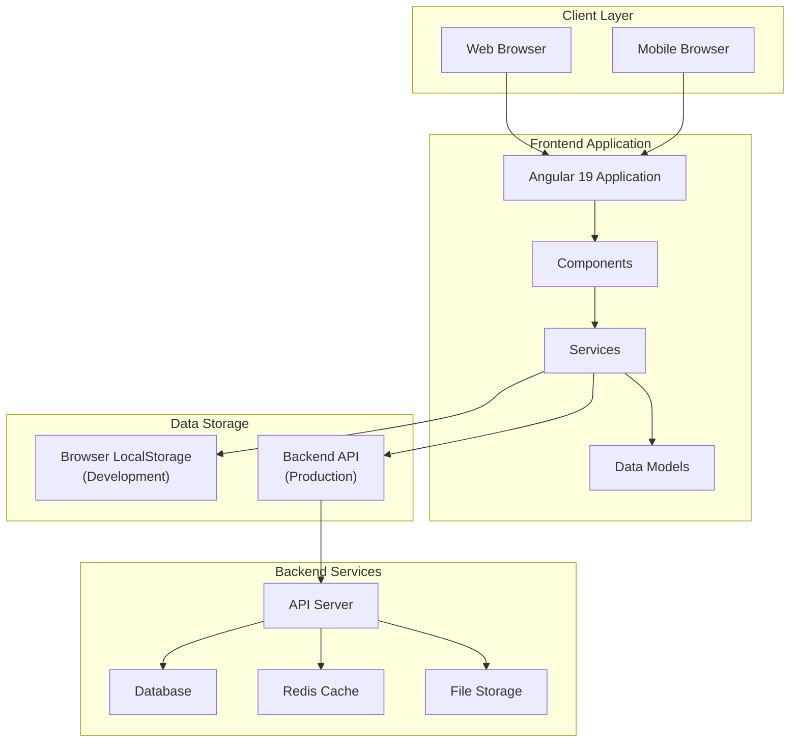
```mermaid
graph TB
    subgraph Client["Client Layer"]
        Browser["Web Browser"]
        Mobile["Mobile Browser"]
    end
    
    subgraph Frontend["Frontend Application"]
        AngularApp["Angular 19 Application"]
        Components["Components"]
        Services["Services"]
        Models["Data Models"]
    end
    
    subgraph Storage["Data Storage"]
        LocalStorage["Browser LocalStorage<br/>(Development)"]
        BackendAPI["Backend API<br/>(Production)"]
    end
    
    subgraph Backend["Backend Services"]
        APIServer["API Server"]
        Database["Database"]
        Cache["Redis Cache"]
        FileStorage["File Storage"]
    end
    
    Browser --> AngularApp
    Mobile --> AngularApp
    AngularApp --> Components
    Components --> Services
    Services --> Models
    Services --> LocalStorage
    Services --> BackendAPI
    BackendAPI --> APIServer
    APIServer --> Database
    APIServer --> Cache
    APIServer --> FileStorage
```

### 6.2 Component Architecture

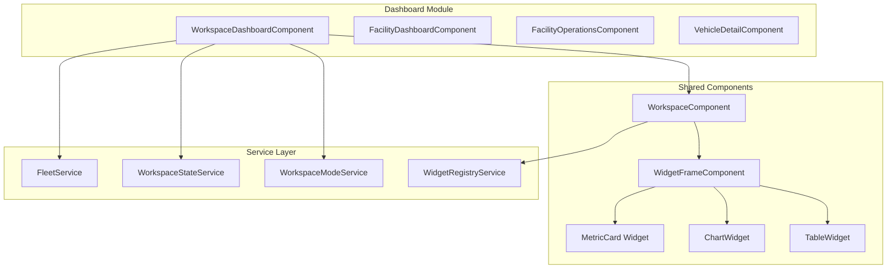
```mermaid
graph TB
    subgraph Dashboard["Dashboard Module"]
        WSDashboard["WorkspaceDashboardComponent"]
        FacDashboard["FacilityDashboardComponent"]
        FacOps["FacilityOperationsComponent"]
        VehDetail["VehicleDetailComponent"]
    end
    
    subgraph Shared["Shared Components"]
        Workspace["WorkspaceComponent"]
        WidgetFrame["WidgetFrameComponent"]
        MetricCard["MetricCard Widget"]
        ChartWidget["ChartWidget"]
        TableWidget["TableWidget"]
    end
    
    subgraph Services["Service Layer"]
        FleetService["FleetService"]
        WorkspaceState["WorkspaceStateService"]
        WorkspaceMode["WorkspaceModeService"]
        WidgetRegistry["WidgetRegistryService"]
    end
    
    WSDashboard --> Workspace
    Workspace --> WidgetFrame
    WidgetFrame --> MetricCard
    WidgetFrame --> ChartWidget
    WidgetFrame --> TableWidget
    
    WSDashboard --> FleetService
    WSDashboard --> WorkspaceState
    WSDashboard --> WorkspaceMode
    Workspace --> WidgetRegistry
```

### 6.3 Data Flow Diagram

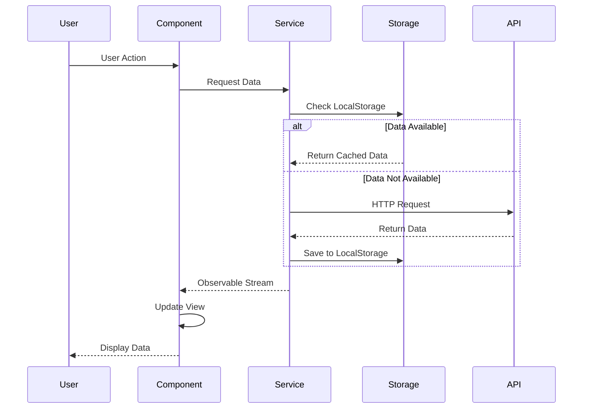
```mermaid
sequenceDiagram
    participant User
    participant Component
    participant Service
    participant Storage
    participant API
    
    User->>Component: User Action
    Component->>Service: Request Data
    Service->>Storage: Check LocalStorage
    alt Data Available
        Storage-->>Service: Return Cached Data
    else Data Not Available
        Service->>API: HTTP Request
        API-->>Service: Return Data
        Service->>Storage: Save to LocalStorage
    end
    Service-->>Component: Observable Stream
    Component->>Component: Update View
    Component-->>User: Display Data
```

### 6.4 Workspace System Flow

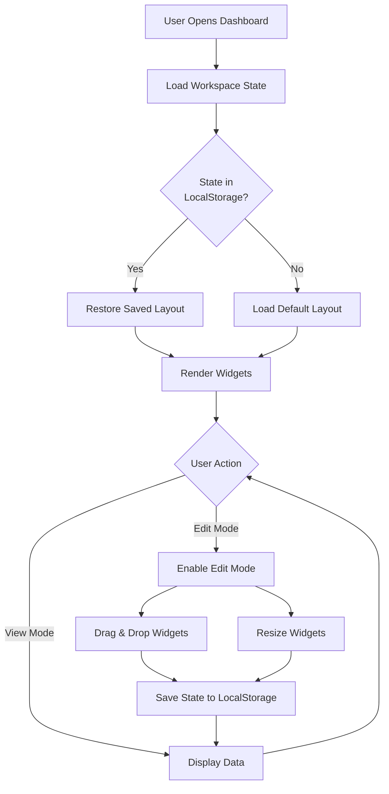
```mermaid
flowchart TD
    Start["User Opens Dashboard"] --> LoadState["Load Workspace State"]
    LoadState --> CheckStorage{"State in<br/>LocalStorage?"}
    CheckStorage -->|Yes| RestoreLayout["Restore Saved Layout"]
    CheckStorage -->|No| DefaultLayout["Load Default Layout"]
    RestoreLayout --> RenderWidgets["Render Widgets"]
    DefaultLayout --> RenderWidgets
    RenderWidgets --> UserInteraction{"User Action"}
    UserInteraction -->|Edit Mode| EnableEdit["Enable Edit Mode"]
    UserInteraction -->|View Mode| DisplayData["Display Data"]
    EnableEdit --> DragDrop["Drag & Drop Widgets"]
    EnableEdit --> Resize["Resize Widgets"]
    DragDrop --> SaveState["Save State to LocalStorage"]
    Resize --> SaveState
    SaveState --> DisplayData
    DisplayData --> UserInteraction
```

### 6.5 Service Dependency Graph

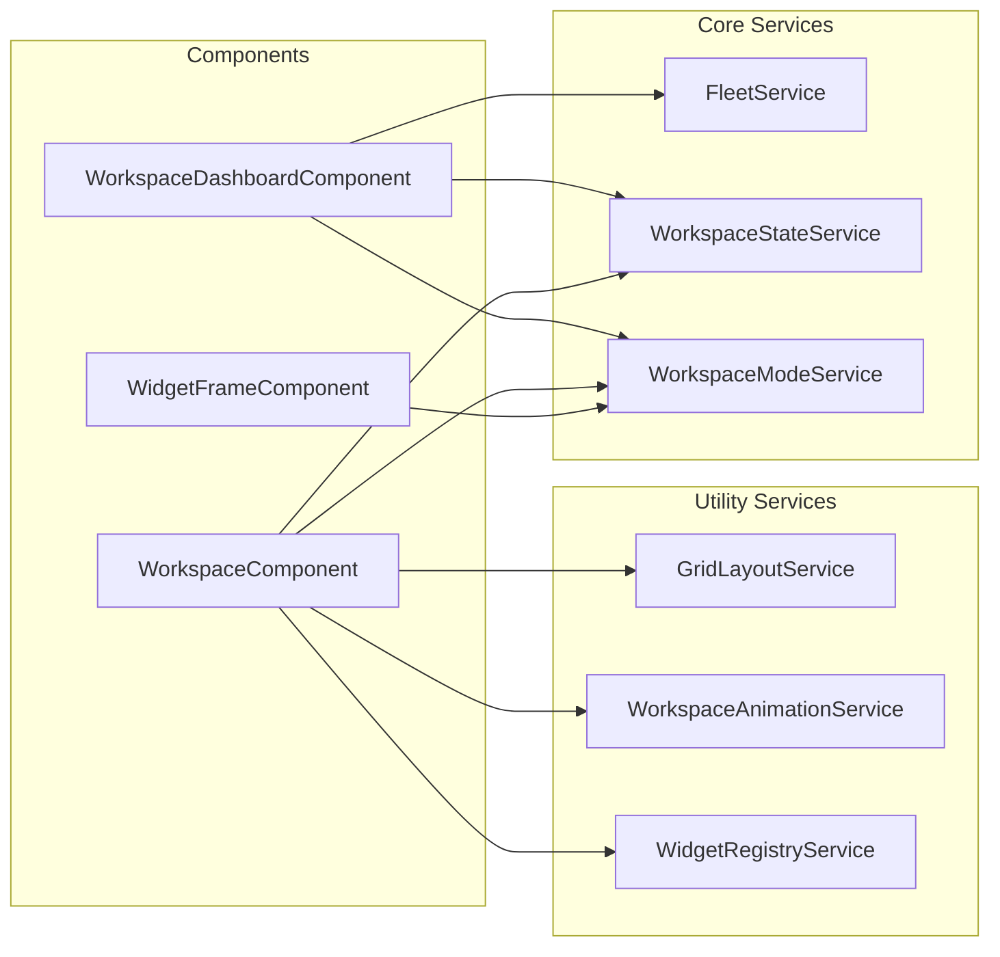
```mermaid
graph LR
    subgraph Core["Core Services"]
        FleetService["FleetService"]
        WorkspaceState["WorkspaceStateService"]
        WorkspaceMode["WorkspaceModeService"]
    end
    
    subgraph Utility["Utility Services"]
        GridLayout["GridLayoutService"]
        Animation["WorkspaceAnimationService"]
        WidgetRegistry["WidgetRegistryService"]
    end
    
    subgraph Components["Components"]
        WSDashboard["WorkspaceDashboardComponent"]
        Workspace["WorkspaceComponent"]
        WidgetFrame["WidgetFrameComponent"]
    end
    
    WSDashboard --> FleetService
    WSDashboard --> WorkspaceState
    WSDashboard --> WorkspaceMode
    Workspace --> WorkspaceState
    Workspace --> WorkspaceMode
    Workspace --> GridLayout
    Workspace --> Animation
    Workspace --> WidgetRegistry
    WidgetFrame --> WorkspaceMode
```

### 6.6 User Interaction Flow

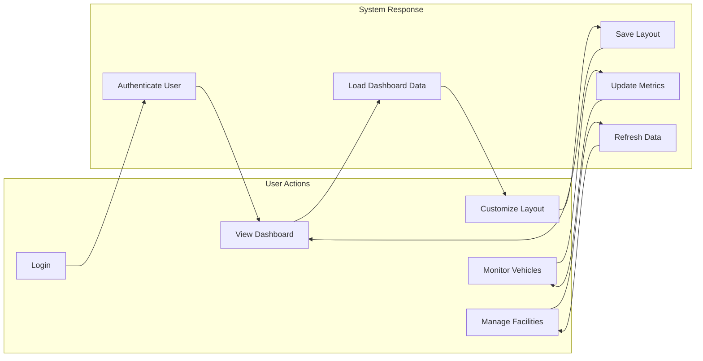
```mermaid
flowchart LR
    subgraph UserActions["User Actions"]
        Login["Login"]
        ViewDashboard["View Dashboard"]
        Customize["Customize Layout"]
        Monitor["Monitor Vehicles"]
        ManageFacilities["Manage Facilities"]
    end
    
    subgraph SystemResponse["System Response"]
        Authenticate["Authenticate User"]
        LoadData["Load Dashboard Data"]
        SaveLayout["Save Layout"]
        UpdateMetrics["Update Metrics"]
        RefreshData["Refresh Data"]
    end
    
    Login --> Authenticate
    ViewDashboard --> LoadData
    Customize --> SaveLayout
    Monitor --> UpdateMetrics
    ManageFacilities --> RefreshData
    
    Authenticate --> ViewDashboard
    LoadData --> Customize
    SaveLayout --> ViewDashboard
    UpdateMetrics --> Monitor
    RefreshData --> ManageFacilities
```

### 6.7 Technology Stack Diagram

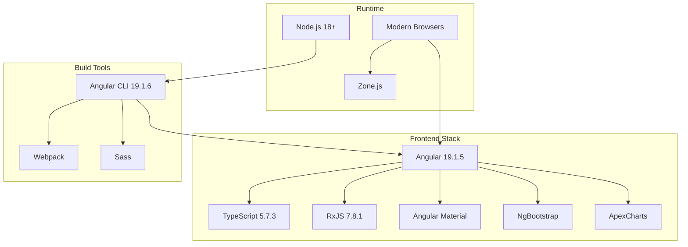
```mermaid
graph TB
    subgraph Frontend["Frontend Stack"]
        Angular["Angular 19.1.5"]
        TypeScript["TypeScript 5.7.3"]
        RxJS["RxJS 7.8.1"]
        Material["Angular Material"]
        Bootstrap["NgBootstrap"]
        Charts["ApexCharts"]
    end
    
    subgraph Build["Build Tools"]
        AngularCLI["Angular CLI 19.1.6"]
        Webpack["Webpack"]
        Sass["Sass"]
    end
    
    subgraph Runtime["Runtime"]
        NodeJS["Node.js 18+"]
        ZoneJS["Zone.js"]
        Browser["Modern Browsers"]
    end
    
    Angular --> TypeScript
    Angular --> RxJS
    Angular --> Material
    Angular --> Bootstrap
    Angular --> Charts
    AngularCLI --> Angular
    AngularCLI --> Webpack
    AngularCLI --> Sass
    NodeJS --> AngularCLI
    Browser --> Angular
    Browser --> ZoneJS
```

### 6.8 Complete Dashboard Component Flow

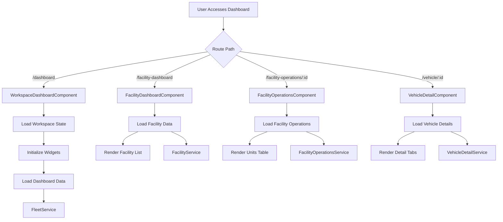
```mermaid
flowchart TD
    User["User Accesses Dashboard"] --> Route{"Route Path"}
    
    Route -->|"/dashboard"| WSDashboard["WorkspaceDashboardComponent"]
    Route -->|"/facility-dashboard"| FacDashboard["FacilityDashboardComponent"]
    Route -->|"/facility-operations/:id"| FacOps["FacilityOperationsComponent"]
    Route -->|"/vehicle/:id"| VehDetail["VehicleDetailComponent"]
    
    WSDashboard --> LoadWorkspace["Load Workspace State"]
    LoadWorkspace --> InitWidgets["Initialize Widgets"]
    InitWidgets --> LoadData["Load Dashboard Data"]
    
    FacDashboard --> LoadFacilities["Load Facility Data"]
    LoadFacilities --> RenderFacilities["Render Facility List"]
    
    FacOps --> LoadFacilityOps["Load Facility Operations"]
    LoadFacilityOps --> RenderUnits["Render Units Table"]
    
    VehDetail --> LoadVehicle["Load Vehicle Details"]
    LoadVehicle --> RenderTabs["Render Detail Tabs"]
    
    LoadData --> FleetService["FleetService"]
    LoadFacilities --> FacilityService["FacilityService"]
    LoadFacilityOps --> FacilityOpsService["FacilityOperationsService"]
    LoadVehicle --> VehicleDetailService["VehicleDetailService"]
```

### 6.9 Widget System Architecture

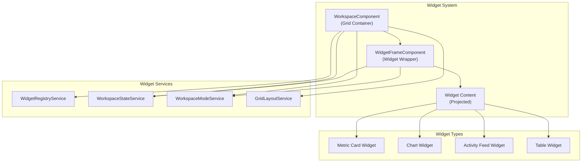
```mermaid
graph TB
    subgraph WidgetSystem["Widget System"]
        Workspace["WorkspaceComponent<br/>(Grid Container)"]
        WidgetFrame["WidgetFrameComponent<br/>(Widget Wrapper)"]
        WidgetContent["Widget Content<br/>(Projected)"]
    end
    
    subgraph WidgetTypes["Widget Types"]
        MetricCard["Metric Card Widget"]
        ChartWidget["Chart Widget"]
        ActivityFeed["Activity Feed Widget"]
        TableWidget["Table Widget"]
    end
    
    subgraph WidgetServices["Widget Services"]
        WidgetRegistry["WidgetRegistryService"]
        StateService["WorkspaceStateService"]
        ModeService["WorkspaceModeService"]
        GridService["GridLayoutService"]
    end
    
    Workspace --> WidgetFrame
    WidgetFrame --> WidgetContent
    
    WidgetContent --> MetricCard
    WidgetContent --> ChartWidget
    WidgetContent --> ActivityFeed
    WidgetContent --> TableWidget
    
    Workspace --> WidgetRegistry
    Workspace --> StateService
    Workspace --> ModeService
    Workspace --> GridService
    
    WidgetFrame --> ModeService
    WidgetFrame --> StateService
```

### 6.10 Data Flow - Workspace Dashboard

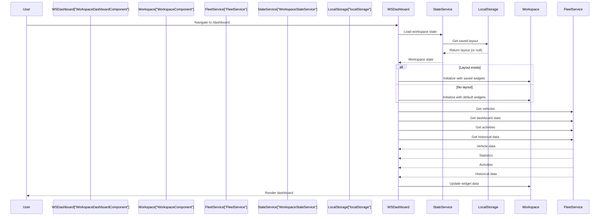
```mermaid
sequenceDiagram
    participant User
    participant WSDashboard["WorkspaceDashboardComponent"]
    participant Workspace["WorkspaceComponent"]
    participant FleetService["FleetService"]
    participant StateService["WorkspaceStateService"]
    participant LocalStorage["localStorage"]
    
    User->>WSDashboard: Navigate to /dashboard
    WSDashboard->>StateService: Load workspace state
    StateService->>LocalStorage: Get saved layout
    LocalStorage-->>StateService: Return layout (or null)
    StateService-->>WSDashboard: Workspace state
    
    alt Layout exists
        WSDashboard->>Workspace: Initialize with saved widgets
    else No layout
        WSDashboard->>Workspace: Initialize with default widgets
    end
    
    WSDashboard->>FleetService: Get vehicles
    WSDashboard->>FleetService: Get dashboard stats
    WSDashboard->>FleetService: Get activities
    WSDashboard->>FleetService: Get historical data
    
    FleetService-->>WSDashboard: Vehicle data
    FleetService-->>WSDashboard: Statistics
    FleetService-->>WSDashboard: Activities
    FleetService-->>WSDashboard: Historical data
    
    WSDashboard->>Workspace: Update widget data
    Workspace-->>User: Render dashboard
```

### 6.11 Widget Lifecycle

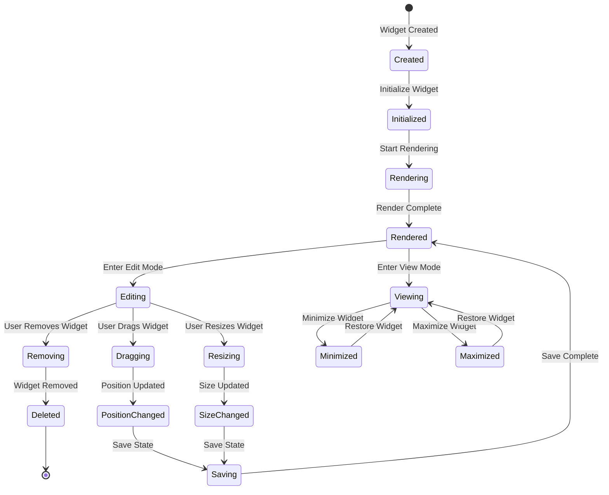
```mermaid
stateDiagram-v2
    [*] --> Created: Widget Created
    Created --> Initialized: Initialize Widget
    Initialized --> Rendering: Start Rendering
    Rendering --> Rendered: Render Complete
    
    Rendered --> Editing: Enter Edit Mode
    Rendered --> Viewing: Enter View Mode
    
    Editing --> Dragging: User Drags Widget
    Editing --> Resizing: User Resizes Widget
    Editing --> Removing: User Removes Widget
    
    Dragging --> PositionChanged: Position Updated
    Resizing --> SizeChanged: Size Updated
    
    PositionChanged --> Saving: Save State
    SizeChanged --> Saving: Save State
    
    Saving --> Rendered: Save Complete
    
    Removing --> Deleted: Widget Removed
    Deleted --> [*]
    
    Viewing --> Minimized: Minimize Widget
    Viewing --> Maximized: Maximize Widget
    Minimized --> Viewing: Restore Widget
    Maximized --> Viewing: Restore Widget
```

### 6.12 Service Interaction Diagram

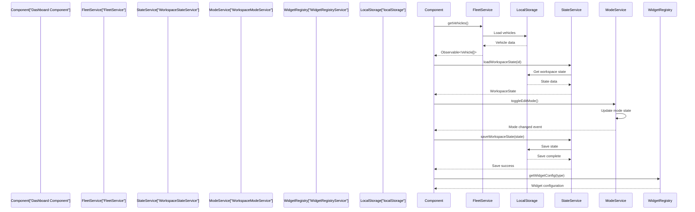
```mermaid
sequenceDiagram
    participant Component["Dashboard Component"]
    participant FleetService["FleetService"]
    participant StateService["WorkspaceStateService"]
    participant ModeService["WorkspaceModeService"]
    participant WidgetRegistry["WidgetRegistryService"]
    participant LocalStorage["localStorage"]
    
    Component->>FleetService: getVehicles()
    FleetService->>LocalStorage: Load vehicles
    LocalStorage-->>FleetService: Vehicle data
    FleetService-->>Component: Observable<Vehicle[]>
    
    Component->>StateService: loadWorkspaceState(id)
    StateService->>LocalStorage: Get workspace state
    LocalStorage-->>StateService: State data
    StateService-->>Component: WorkspaceState
    
    Component->>ModeService: toggleEditMode()
    ModeService->>ModeService: Update mode state
    ModeService-->>Component: Mode changed event
    
    Component->>StateService: saveWorkspaceState(state)
    StateService->>LocalStorage: Save state
    LocalStorage-->>StateService: Save complete
    StateService-->>Component: Save success
    
    Component->>WidgetRegistry: getWidgetConfig(type)
    WidgetRegistry-->>Component: Widget configuration
```

### 6.13 Dashboard Navigation Flow

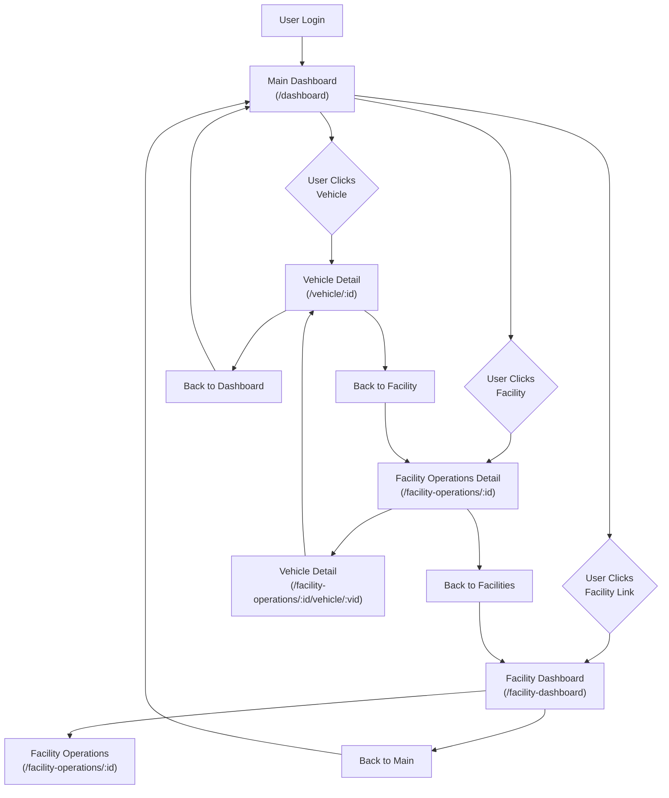
```mermaid
flowchart TD
    Start["User Login"] --> MainDashboard["Main Dashboard<br/>(/dashboard)"]
    
    MainDashboard --> FacilityDash{"User Clicks<br/>Facility Link"}
    MainDashboard --> VehicleDetail{"User Clicks<br/>Vehicle"}
    MainDashboard --> FacilityOps{"User Clicks<br/>Facility"}
    
    FacilityDash --> FacilityDashboard["Facility Dashboard<br/>(/facility-dashboard)"]
    FacilityDashboard --> FacilityOps2["Facility Operations<br/>(/facility-operations/:id)"]
    FacilityDashboard --> Back1["Back to Main"]
    
    FacilityOps --> FacilityOpsDetail["Facility Operations Detail<br/>(/facility-operations/:id)"]
    FacilityOpsDetail --> VehicleFromFac["Vehicle Detail<br/>(/facility-operations/:id/vehicle/:vid)"]
    FacilityOpsDetail --> Back2["Back to Facilities"]
    
    VehicleDetail --> VehicleDetailPage["Vehicle Detail<br/>(/vehicle/:id)"]
    VehicleFromFac --> VehicleDetailPage
    VehicleDetailPage --> Back3["Back to Dashboard"]
    VehicleDetailPage --> Back4["Back to Facility"]
    
    Back1 --> MainDashboard
    Back2 --> FacilityDashboard
    Back3 --> MainDashboard
    Back4 --> FacilityOpsDetail
```

### 6.14 Data Model Relationships

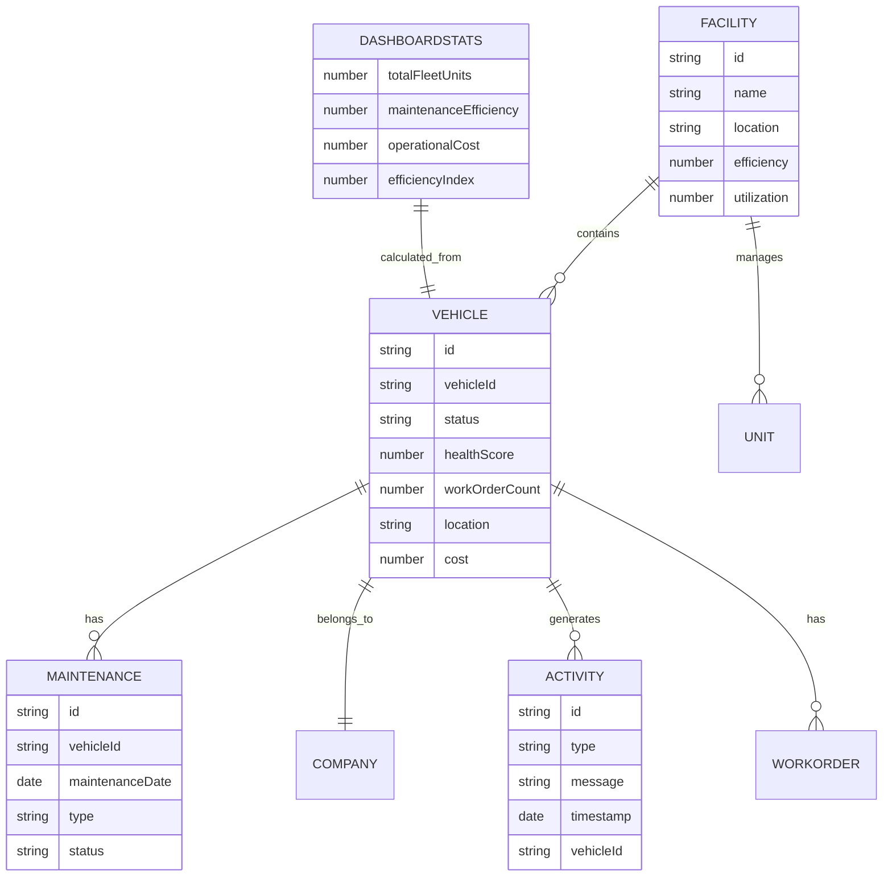
```mermaid
erDiagram
    VEHICLE ||--o{ MAINTENANCE : has
    VEHICLE ||--|| COMPANY : belongs_to
    VEHICLE ||--o{ ACTIVITY : generates
    FACILITY ||--o{ VEHICLE : contains
    FACILITY ||--o{ UNIT : manages
    VEHICLE ||--o{ WORKORDER : has
    DASHBOARDSTATS ||--|| VEHICLE : calculated_from
    
    VEHICLE {
        string id
        string vehicleId
        string status
        number healthScore
        number workOrderCount
        string location
        number cost
    }
    
    FACILITY {
        string id
        string name
        string location
        number efficiency
        number utilization
    }
    
    MAINTENANCE {
        string id
        string vehicleId
        date maintenanceDate
        string type
        string status
    }
    
    ACTIVITY {
        string id
        string type
        string message
        date timestamp
        string vehicleId
    }
    
    DASHBOARDSTATS {
        number totalFleetUnits
        number maintenanceEfficiency
        number operationalCost
        number efficiencyIndex
    }
```

### 6.15 Widget Configuration Schema

```mermaid
graph LR
    subgraph WidgetConfig["Widget Configuration"]
        WidgetID["Widget ID<br/>string"]
        WidgetType["Widget Type<br/>metric-card|chart|table|feed"]
        WidgetTitle["Widget Title<br/>string"]
        WidgetIcon["Widget Icon<br/>string"]
        WidgetPosition["Position<br/>GridPosition"]
        WidgetSize["Size<br/>WidgetSize"]
        WidgetConfig["Config<br/>any"]
    end
    
    subgraph GridPosition["Grid Position"]
        Column["Column<br/>1-12"]
        Row["Row<br/>number"]
        ColumnSpan["Column Span<br/>1-4"]
        RowSpan["Row Span<br/>1-4"]
    end
    
    subgraph WidgetSize["Widget Size"]
        Width["Width<br/>1-4"]
        Height["Height<br/>1-4"]
    end
    
    WidgetID --> WidgetConfig
    WidgetType --> WidgetConfig
    WidgetTitle --> WidgetConfig
    WidgetIcon --> WidgetConfig
    WidgetPosition --> WidgetConfig
    WidgetSize --> WidgetConfig
    
    Column --> WidgetPosition
    Row --> WidgetPosition
    ColumnSpan --> WidgetPosition
    RowSpan --> WidgetPosition
    
    Width --> WidgetSize
    Height --> WidgetSize
```

### 6.16 Complete System Integration

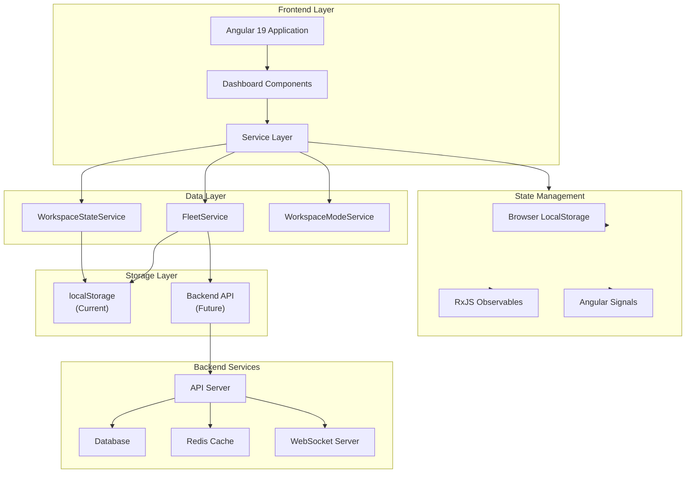
```mermaid
graph TB
    subgraph Frontend["Frontend Layer"]
        AngularApp["Angular 19 Application"]
        Components["Dashboard Components"]
        Services["Service Layer"]
    end
    
    subgraph StateManagement["State Management"]
        LocalStorage["Browser LocalStorage"]
        RxJS["RxJS Observables"]
        Signals["Angular Signals"]
    end
    
    subgraph DataLayer["Data Layer"]
        FleetService["FleetService"]
        WorkspaceService["WorkspaceStateService"]
        ModeService["WorkspaceModeService"]
    end
    
    subgraph Storage["Storage Layer"]
        LocalStorageDB["localStorage<br/>(Current)"]
        BackendAPI["Backend API<br/>(Future)"]
    end
    
    subgraph Backend["Backend Services<br/>(Future)"]
        APIServer["API Server"]
        Database["Database"]
        Cache["Redis Cache"]
        WebSocket["WebSocket Server"]
    end
    
    AngularApp --> Components
    Components --> Services
    Services --> StateManagement
    StateManagement --> LocalStorage
    StateManagement --> RxJS
    StateManagement --> Signals
    
    Services --> FleetService
    Services --> WorkspaceService
    Services --> ModeService
    
    FleetService --> LocalStorageDB
    FleetService --> BackendAPI
    WorkspaceService --> LocalStorageDB
    
    BackendAPI --> APIServer
    APIServer --> Database
    APIServer --> Cache
    APIServer --> WebSocket
```

### 6.17 Feature Comparison Matrix

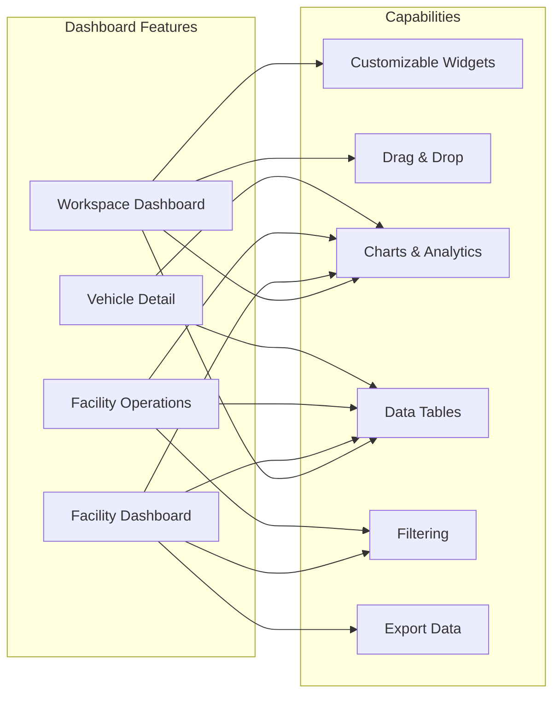
```mermaid
graph LR
    subgraph Features["Dashboard Features"]
        WSDash["Workspace Dashboard"]
        FacDash["Facility Dashboard"]
        FacOps["Facility Operations"]
        VehDetail["Vehicle Detail"]
    end
    
    subgraph Capabilities["Capabilities"]
        Widgets["Customizable Widgets"]
        DragDrop["Drag & Drop"]
        Charts["Charts & Analytics"]
        Tables["Data Tables"]
        Filters["Filtering"]
        Export["Export Data"]
    end
    
    WSDash --> Widgets
    WSDash --> DragDrop
    WSDash --> Charts
    WSDash --> Tables
    
    FacDash --> Charts
    FacDash --> Tables
    FacDash --> Filters
    FacDash --> Export
    
    FacOps --> Charts
    FacOps --> Tables
    FacOps --> Filters
    
    VehDetail --> Charts
    VehDetail --> Tables
```

### 6.18 Authentication & Authorization Flow

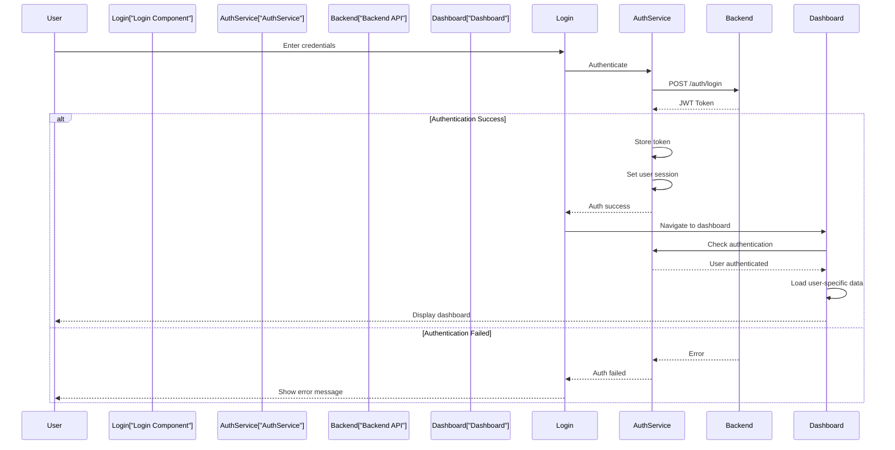
```mermaid
sequenceDiagram
    participant User
    participant Login["Login Component"]
    participant AuthService["AuthService"]
    participant Backend["Backend API"]
    participant Dashboard["Dashboard"]
    
    User->>Login: Enter credentials
    Login->>AuthService: Authenticate
    AuthService->>Backend: POST /auth/login
    Backend-->>AuthService: JWT Token
    
    alt Authentication Success
        AuthService->>AuthService: Store token
        AuthService->>AuthService: Set user session
        AuthService-->>Login: Auth success
        Login->>Dashboard: Navigate to dashboard
        Dashboard->>AuthService: Check authentication
        AuthService-->>Dashboard: User authenticated
        Dashboard->>Dashboard: Load user-specific data
        Dashboard-->>User: Display dashboard
    else Authentication Failed
        Backend-->>AuthService: Error
        AuthService-->>Login: Auth failed
        Login-->>User: Show error message
    end
```

### 6.19 Real-Time Data Update Flow

```mermaid
sequenceDiagram
    participant Dashboard["Dashboard Component"]
    participant FleetService["FleetService"]
    participant Interval["Auto-Refresh Interval<br/>(5 minutes)"]
    participant Backend["Backend API<br/>(Future)"]
    participant WebSocket["WebSocket<br/>(Future)"]
    
    Dashboard->>FleetService: Initial data load
    FleetService->>Backend: GET /api/vehicles
    Backend-->>FleetService: Vehicle data
    FleetService-->>Dashboard: Update vehicles
    
    Interval->>FleetService: Trigger refresh
    FleetService->>Backend: GET /api/vehicles/updated
    Backend-->>FleetService: Updated data
    FleetService-->>Dashboard: Emit dataRefresh$ event
    Dashboard->>Dashboard: Reload data
    
    Note over WebSocket: Future Implementation
    WebSocket->>Dashboard: Real-time update event
    Dashboard->>Dashboard: Update specific data
```

### 6.20 Error Handling Flow

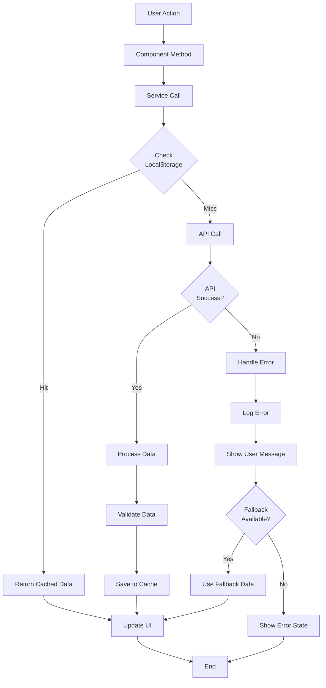
```mermaid
flowchart TD
    Start["User Action"] --> Component["Component Method"]
    Component --> Service["Service Call"]
    
    Service --> CheckCache{"Check<br/>LocalStorage"}
    CheckCache -->|Hit| ReturnCached["Return Cached Data"]
    CheckCache -->|Miss| APICall["API Call"]
    
    APICall --> Success{"API<br/>Success?"}
    
    Success -->|Yes| ProcessData["Process Data"]
    Success -->|No| HandleError["Handle Error"]
    
    HandleError --> LogError["Log Error"]
    LogError --> ShowMessage["Show User Message"]
    ShowMessage --> Fallback{"Fallback<br/>Available?"}
    
    Fallback -->|Yes| UseFallback["Use Fallback Data"]
    Fallback -->|No| ShowError["Show Error State"]
    
    ProcessData --> ValidateData["Validate Data"]
    ValidateData --> SaveCache["Save to Cache"]
    SaveCache --> UpdateUI["Update UI"]
    
    ReturnCached --> UpdateUI
    UseFallback --> UpdateUI
    ShowError --> End["End"]
    UpdateUI --> End
```

---

## 7. Development Roadmap

### 7.1 Phase 1: Core Features (Completed)

- ✅ Workspace dashboard with drag-and-drop
- ✅ Vehicle management and tracking
- ✅ Basic analytics and charts
- ✅ LocalStorage persistence

### 7.2 Phase 2: Enhanced Features (In Progress)

- 🔄 Facility management integration
- 🔄 Real-time data synchronization
- 🔄 Advanced filtering and search
- 🔄 Export functionality

### 7.3 Phase 3: Production Readiness (Planned)

- ⏳ Backend API integration
- ⏳ Authentication and authorization
- ⏳ Database migration
- ⏳ Performance optimization
- ⏳ Comprehensive testing

### 7.4 Phase 4: Advanced Features (Future)

- ⏳ Mobile application
- ⏳ Real-time notifications
- ⏳ Advanced reporting
- ⏳ Machine learning insights
- ⏳ Integration with third-party systems

---

## 8. Risk Assessment & Mitigation

### 8.1 Technical Risks

#### 8.1.1 Browser Compatibility
- **Risk**: Inconsistent behavior across different browsers
- **Impact**: High - affects user experience
- **Mitigation**: 
  - Test across major browsers (Chrome, Firefox, Safari, Edge)
  - Use polyfills for older browser support
  - Progressive enhancement approach

#### 8.1.2 Performance with Large Datasets
- **Risk**: Slow performance with large number of vehicles
- **Impact**: High - affects usability
- **Mitigation**:
  - Implement pagination and virtual scrolling
  - Use lazy loading for data
  - Optimize database queries
  - Implement caching strategies

#### 8.1.3 Data Loss
- **Risk**: Loss of data stored in localStorage
- **Impact**: Medium - user preferences lost
- **Mitigation**:
  - Implement backup strategies
  - Regular data synchronization
  - Cloud backup for critical data
  - User notification on data loss

#### 8.1.4 Migration from LocalStorage to Database
- **Risk**: Complex migration process
- **Impact**: Medium - development overhead
- **Mitigation**:
  - Design data models for easy migration
  - Create migration scripts
  - Plan migration during low-usage periods
  - Test migration thoroughly

### 8.2 Business Risks

#### 8.2.1 User Adoption
- **Risk**: Low user adoption rate
- **Impact**: High - project failure
- **Mitigation**:
  - Provide comprehensive training
  - Create detailed documentation
  - Gather user feedback early
  - Implement intuitive UI/UX

#### 8.2.2 Scalability
- **Risk**: System cannot handle growth
- **Impact**: High - requires major refactoring
- **Mitigation**:
  - Design for scalability from day one
  - Use microservices architecture
  - Implement horizontal scaling
  - Regular performance testing

#### 8.2.3 Maintenance
- **Risk**: High maintenance costs
- **Impact**: Medium - ongoing costs
- **Mitigation**:
  - Establish clear maintenance procedures
  - Document all code thoroughly
  - Use automated testing
  - Regular code reviews

---

## 9. Success Metrics

### 9.1 Technical Metrics

#### 9.1.1 Performance Metrics
- **Page Load Time**: < 3 seconds
- **Time to Interactive**: < 5 seconds
- **First Contentful Paint**: < 1.5 seconds
- **Largest Contentful Paint**: < 2.5 seconds

#### 9.1.2 Quality Metrics
- **Zero Critical Bugs**: In production
- **Code Coverage**: > 80% for unit tests
- **Uptime**: 99.9% availability
- **Error Rate**: < 0.1% of requests

#### 9.1.3 Security Metrics
- **Vulnerability Score**: Zero high/critical vulnerabilities
- **Security Audit**: Passed annual security audit
- **Data Breaches**: Zero incidents
- **Compliance**: Meet industry standards (GDPR, etc.)

### 9.2 Business Metrics

#### 9.2.1 User Adoption
- **Active Users**: Track daily/monthly active users
- **User Retention**: > 70% monthly retention
- **Feature Adoption**: Track usage of key features
- **User Satisfaction**: > 4.0/5.0 rating

#### 9.2.2 Operational Metrics
- **Dashboard Customization**: % of users customizing layouts
- **Data Refresh Frequency**: Average refresh rate
- **Feature Utilization**: Usage rates for each feature
- **Support Tickets**: Track and reduce support requests

#### 9.2.3 Business Impact
- **Cost Reduction**: Track operational cost savings
- **Efficiency Improvement**: Measure time saved
- **Decision Quality**: Track data-driven decisions made
- **ROI**: Calculate return on investment

---

## 10. Conclusion

The FleetPulse Dashboard represents a modern, scalable solution for fleet management with a focus on user experience and customization. Built on Angular 19 with best practices, it provides a solid foundation for growth and enhancement. The modular architecture allows for easy extension and maintenance, while the customizable workspace ensures users can tailor the interface to their specific needs.

### 10.1 Key Strengths

1. **Modern Technology Stack**: Built with latest Angular 19 features
2. **User-Centric Design**: Customizable workspace with drag-and-drop
3. **Comprehensive Features**: Complete fleet management solution
4. **Scalable Architecture**: Designed for growth from small to enterprise
5. **Well-Documented**: Comprehensive documentation for developers and users

### 10.2 Future Opportunities

1. **Mobile Application**: Native mobile apps for iOS and Android
2. **Advanced Analytics**: Machine learning for predictive maintenance
3. **Integration**: Connect with third-party fleet management systems
4. **Real-Time Features**: Enhanced real-time monitoring and alerts
5. **Global Expansion**: Multi-language and multi-currency support

### 10.3 Next Steps

1. **Complete Phase 2**: Finish enhanced features currently in progress
2. **Backend Integration**: Implement production-ready backend API
3. **Testing**: Comprehensive testing suite (unit, integration, e2e)
4. **Performance Optimization**: Optimize for production workloads
5. **Deployment**: Deploy to production environment

The project is well-positioned for production deployment with proper backend integration and follows modern web development standards for security, performance, and maintainability. With continued development and refinement, FleetPulse Dashboard will become a leading solution in the fleet management software market.

---

## Appendix A: Glossary

- **Widget**: A reusable UI component that displays specific data or functionality
- **Workspace**: The customizable dashboard area where widgets are arranged
- **Health Score**: A numerical indicator (0-100) representing vehicle condition
- **Work Order**: A maintenance task assigned to a vehicle
- **Facility**: A physical location where vehicles are maintained or stored
- **Telemetry**: Real-time data from vehicles (location, status, metrics)
- **LocalStorage**: Browser-based storage for client-side data persistence
- **Observable**: RxJS pattern for handling asynchronous data streams
- **Signal**: Angular's reactive primitive for state management
- **Standalone Component**: Angular component that doesn't require NgModule

## Appendix B: References

- [Angular Documentation](https://angular.io/docs)
- [TypeScript Documentation](https://www.typescriptlang.org/docs/)
- [RxJS Documentation](https://rxjs.dev/)
- [ApexCharts Documentation](https://apexcharts.com/)
- [CSS Grid Guide](https://developer.mozilla.org/en-US/docs/Web/CSS/CSS_Grid_Layout)
- [Angular Material](https://material.angular.io/)

## Appendix C: Version History

- **Version 1.0.0** (2025-01-16): Initial project proposal document
  - Complete feature specification
  - Technical implementation details
  - Architecture diagrams
  - Infrastructure planning
  - Risk assessment and success metrics

---

**Document Version**: 1.0.0  
**Last Updated**: 2025-01-16  
**Author**: FleetPulse Development Team  
**Status**: Proposal - Pending Approval
