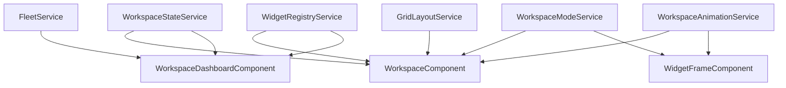

# Services Overview

This directory contains all the business logic services used in the FleetPulse Dashboard.

## 📋 Available Services

| Service | File | Description |
|---------|------|-------------|
| **Fleet** | [`fleet.service.md`](./fleet.service.md) | Vehicle data management with localStorage |
| **Workspace State** | [`workspace-state.service.md`](./workspace-state.service.md) | Workspace state persistence |
| **Workspace Mode** | [`workspace-mode.service.md`](./workspace-mode.service.md) | Edit/View mode management |
| **Grid Layout** | [`grid-layout.service.md`](./grid-layout.service.md) | CSS Grid calculations |
| **Workspace Animation** | [`workspace-animation.service.md`](./workspace-animation.service.md) | Animation utilities |
| **Widget Registry** | [`widget-registry.service.md`](./widget-registry.service.md) | Widget type registry |

## 📍 File Locations

All service files are located in:
```
src/app/shared/services/
```

## 🔗 How Services Connect



## 📚 Next Steps

1. Read individual service documentation files
2. Understand how services connect to components
3. See service usage patterns in components
4. Explore the [Components documentation](../Components/README.md)

---

**Ready to dive in? Start with [Fleet Service](./fleet.service.md)!**
